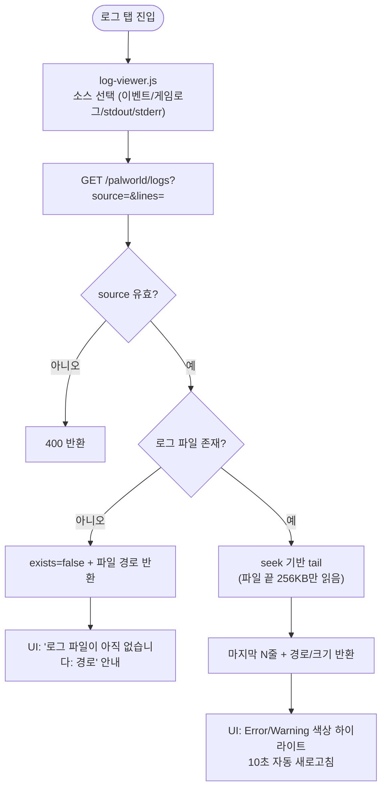
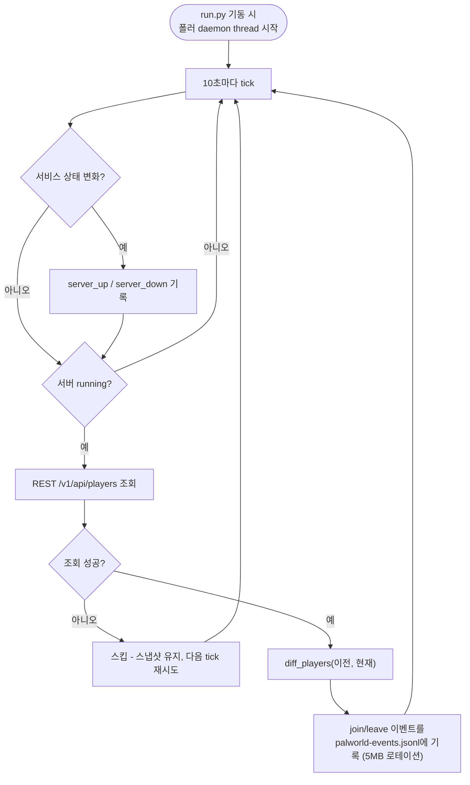

# 팰월드 어드민 개편 - 로그 정상화, 접속 가이드, UI 전면 개선

## 개요

팰월드 관리자 페이지의 로그 기능이 실질적으로 동작하지 않던 문제(NSSM stdout 파일만 tail — 파일이 없으면 조용히 빈 화면, 있어도 내용 빈약)를 해결하고, 접속/퇴장 이벤트를 자체 생성하는 폴러와 게임 접속 가이드를 추가했으며, 어드민 UI 전체를 daisyUI 5 drawer 셸 + Lucide 아이콘 기반으로 전면 개편했다. PR: https://github.com/Cassiiopeia/suh-project-control/pull/54

## 기능 흐름

### 로그 조회 (소스 4종)

### 접속/퇴장 이벤트 자체 생성 (팰월드 서버는 접속 기록을 남기지 않음)

## 변경 사항

### 백엔드 - 로그 정상화

- `suh-ai-server/flask/config/palworld_config.py`: 단일 `LOG_FILE`을 `LOG_SOURCES` 4종으로 교체 — `events`(자체 생성 이벤트), `game`(UE 엔진이 쓰는 진짜 서버 로그 `Pal\Saved\Logs\Pal.log`), `stdout`/`stderr`(NSSM 리다이렉트). 접속 가이드용 `PUBLIC_HOST`/`PUBLIC_PORT` 추가
- `suh-ai-server/flask/service/palworld_service.py`: `tail_logs(source, lines)` seek 기반 재작성 — 파일 끝 256KB만 읽어 대용량 로그에서도 빠르고, 파일이 없으면 **경로를 그대로 응답에 실어** 배포 서버에서 원인을 즉시 진단 가능하게 함
- `suh-ai-server/flask/router/palworld_router.py`: `GET /palworld/logs?source=` 파라미터 추가(잘못된 source는 400), `GET /palworld/guide` 신규
- `suh-ai-server/flask/router/palworld_swagger.py`: logs 파라미터/guide 항목 문서화

### 백엔드 - 접속/퇴장 이벤트 폴러 (신규)

- `suh-ai-server/flask/service/palworld_event_poller.py`: REST `/v1/api/players` 10초 폴링 daemon thread. 순수 함수 `diff_players()`로 join/leave 감지, 서비스 시작/중지 이벤트 포함, JSONL 기록 + 5MB 로테이션. REST 다운 시 스냅샷 유지 후 재시도
- `suh-ai-server/flask/run.py`: 프로덕션 엔트리(waitress)에서만 폴러 기동 — 테스트/디버그 이중 기동 방지

### 백엔드 - 접속 가이드 / 헬스체크

- `GET /palworld/guide`: 공개 주소(`suh-project.synology.me:8211`) + `PalWorldSettings.ini` 실제 값(서버명/비밀번호/최대 인원)을 반환 — 설정을 바꾸면 가이드도 자동 반영. ini가 없어도 주소는 항상 내려줌
- `suh-ai-server/flask/app.py`: `GET /health` 추가 — deploy 스크립트가 체크하던 엔드포인트인데 실제로는 없어서 항상 WARN이 뜨던 문제 해소

### 프론트엔드 - UI 전면 개편

- `suh-ai-server/flask/templates/admin/base.html` (신규): daisyUI 5 `drawer lg:drawer-open` 공용 셸 — 데스크톱 사이드바 고정, 모바일 햄버거 드로어, 다크모드 토글(localStorage 유지), Lucide 아이콘 로컬 번들(CDN 의존 없음). **이모지/ASCII 아이콘 전면 제거**
- `suh-ai-server/flask/templates/admin/palworld.html` (재작성): 상태 히어로(접속자/FPS/업타임 + 제어 버튼) → **게임 접속 가이드 카드**(3단계 안내 + 주소/비밀번호 복사 버튼) → 탭 4종(설정/로그/백업/플레이어). 브라우저 `confirm()`을 daisyUI modal로 교체
- `suh-ai-server/flask/templates/admin/dashboard.html` (재작성): 상태 요약 stats(Flask/팰월드/접속자) + 서비스 카드. 혼동을 유발하던 "Flask 서버 로그" 카드는 전용 페이지로 분리
- `suh-ai-server/flask/templates/admin/logs.html` (신규, `/admin/logs`): Flask 로그 전용 페이지 — 레벨 필터(ERROR/WARNING/INFO) + 검색
- `suh-ai-server/flask/static/js/log-viewer.js` (신규): 공용 로그 뷰어 — 소스 전환, 라인 수 선택, 자동 새로고침, Error/Warning 하이라이트, 로그 내용은 `textContent` 삽입(XSS 방지), 이벤트 JSONL을 한국어 문장으로 포맷
- `suh-ai-server/flask/static/js/palworld.js`: 가이드 로딩/복사, confirm modal, 로그 뷰어 연동
- `suh-ai-server/flask/frontend/`: `lucide` 의존성 추가 + `copy-vendor.js`로 빌드 시 `static/js/vendor/`에 번들 복사

### 운영

- `suh-ai-server/scripts/setup-palworld.ps1`: NSSM 로그 로테이션 추가(`AppRotateFiles`/`AppRotateOnline`/`AppRotateBytes` 10MB) — stdout/stderr 파일 무한 성장 방지

### 테스트

- 총 49개 통과 — 신규: seek tail 정확성(대용량 파일 경계 포함)/소스 검증, `diff_players` 4케이스, 폴러 tick/로테이션/REST 다운 내성, guide(ini 유무), 어드민 3페이지 렌더 + **no-emoji 검사 테스트**(이모지 재유입 방지)

## 주요 구현 내용

- **"로그가 안 보인다"의 본질 해결**: 문제는 파일을 안 읽는 게 아니라 *읽는 파일에 원하는 내용이 없던 것*. 진짜 서버 로그(Pal.log)를 기본 소스로 바꾸고, 팰월드가 어디에도 기록하지 않는 접속/퇴장은 REST 폴링으로 자체 생성. 파일 부재 시 빈 화면 대신 경로를 노출해 진단 가능하게 함
- **UI는 RomRom-BE 관리자 페이지 패턴 이식**: 검증된 drawer 셸 구조를 Jinja 상속(`base.html`)으로 재사용, 페이지별 중복 제거
- **카톡으로 수동 공유하던 접속 안내를 동적 가이드로**: 관리자 페이지 상단에서 실제 설정값 기반으로 항상 최신 상태 유지

## 주의사항

- **배포 후 서버에서 `setup-palworld.ps1` 1회 재실행 필요** (NSSM 로테이션 적용)
- 이벤트 로그는 배포 후 폴러가 돌기 시작해야 쌓임 — 첫 접속/퇴장 전까지 이벤트 탭이 비어있는 것은 정상
- `GET /palworld/logs` 응답 형태가 `{logs: [...]}` → `{source, log_file, exists, size_bytes, logs}`로 변경됨 (소비자는 어드민 UI뿐이라 함께 갱신 완료)
- 사내 npm 미러의 lucide latest가 1.24.0(구버전) — 새 아이콘 추가 시 해당 버전에 존재하는지 확인 필요
