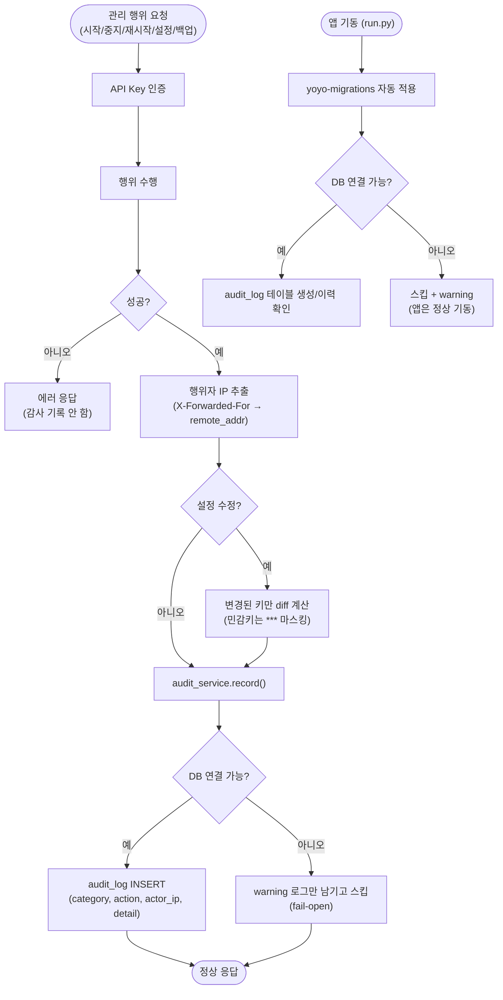

# 관리 행위 감사로그(Audit Log) - PostgreSQL 기록 및 조회

## 개요

팰월드 관리자 페이지는 공유된 단일 API Key로 누구나 서버 제어·설정 수정이 가능했지만, 누가(어느 IP) 언제 무엇을 바꿨는지 기록이 전혀 없었다. 이번 작업으로 관리 행위(서버 시작/중지/재시작, 설정 수정, 백업 생성)가 PostgreSQL `suh_ai_server` DB의 `audit_log` 테이블에 기록되고, 팰월드 로그 뷰어의 새 "감사" 탭에서 바로 조회할 수 있다. DB가 내려가 있어도 관리 행위와 앱 기동은 절대 막히지 않는 fail-open 설계이며, 접속정보는 `.env`(gitignore) + GitHub Secret으로만 관리되어 레포에 노출되지 않는다.

## 기능 흐름

## 변경 사항

### 감사 서비스 (신규)
- `suh-ai-server/flask/service/audit_service.py`: `AuditCategory`(PALWORLD/SYSTEM)·`AuditAction`(SERVER_START/STOP/RESTART/SETTINGS_UPDATE/BACKUP_CREATE) 코드 enum, `record()` fail-open INSERT, `list_logs()` 로그 뷰어 응답 형태 조회, 자격증명 마스킹(`_masked_location`)

### DB 설정 / 마이그레이션 (신규)
- `suh-ai-server/flask/config/db_config.py`: `flask/.env`에서 `AUDIT_DATABASE_URL` 로드(미설정 시 감사 기능 전체 비활성), yoyo-migrations 적용 함수(fail-open)
- `suh-ai-server/flask/migrations/0001__create_audit_log.sql`: `audit_log` 테이블(BIGSERIAL PK, TIMESTAMPTZ, category/action VARCHAR, actor_ip, detail JSONB) + 카테고리·시각 복합 인덱스
- `suh-ai-server/flask/run.py`: 기동 시 마이그레이션 자동 적용 (Spring Boot + Flyway와 동일한 경험)

### 라우터 연동
- `suh-ai-server/flask/router/palworld_router.py`: start/stop/restart/settings/backup **성공 시에만** 기록, 행위자 IP 헬퍼, 설정 변경 diff(실제 달라진 키만, `ServerPassword`/`AdminPassword`는 `***` 마스킹), `GET /palworld/logs?source=audit` 조회 분기

### 프론트
- `suh-ai-server/flask/static/js/palworld.js`: 로그 소스에 "감사" 탭 추가 (기존 뷰어 재사용 — 응답 형태 동일)

### 시크릿 / 배포
- `.gitignore`: `suh-ai-server/flask/.env` 추가
- `.github/workflows/SUH-AI-PROJECT-CONTROL.yaml`: GitHub Secret `FLASK_ENV_FILE` → 배포 시 `flask/.env` 동적 생성 스텝 (Secret 미설정 시 스킵, 기존 파일 유지)
- `suh-ai-server/flask/requirements.txt`: psycopg2-binary, yoyo-migrations, python-dotenv 추가 (배포 스크립트의 기존 pip install이 자동 설치)

### 테스트
- `test_db_config.py`(신규), `test_audit_service.py`(신규), `test_palworld_router.py`(확장) — 전체 **99개 테스트 통과**

## 주요 구현 내용

- **Fail-open 원칙**: DB 다운/URL 미설정이 관리 행위·앱 기동을 절대 막지 않는다. 모든 DB 접점(`record`, `list_logs`, 마이그레이션)이 예외를 삼키고 warning만 남기며, 감사 탭 조회는 `exists:false` + 마스킹된 DB 위치 안내로 열화된다.
- **성공한 행위만 기록**: 행위 수행 `try/except` 이후에만 `record()`가 실행되는 구조라 실패한 행위는 기록 경로에 도달할 수 없다. 설정 수정은 변경 0건이면 기록을 생략한다.
- **확장 가능한 2단 enum 구조**: `category` + `action`을 코드 enum(str Enum) + DB VARCHAR로 관리 (Spring `@Enumerated(STRING)` 철학). 새 서비스/액션 추가는 enum 한 줄이며 DB 마이그레이션이 불필요하다.
- **민감값 보호**: 설정 diff에서 `ServerPassword`/`AdminPassword`는 `*** → ***`로 마스킹해 변경 사실만 남긴다. 감사 탭에 표시되는 DB 위치도 자격증명이 제거된 형태다.
- **마이그레이션 ASCII 가드**: yoyo의 `Migration.load()`가 인코딩 미지정 `open()`을 사용해 Windows(cp949)에서 한국어 주석이 침묵 실패를 유발하는 문제를 발견 — 마이그레이션 SQL을 ASCII 전용으로 유지하고 이를 강제하는 가드 테스트를 추가했다.

## 주의사항

- 첫 배포 시 서버의 pip 미러에서 psycopg2-binary/yoyo-migrations/python-dotenv 3개 패키지가 정상 설치되는지 확인 필요 (Flask 재시작 스텝에서 자연 확인됨)
- 배포 후 검증: 서버 재시작 한 번 → 감사 탭에 `SERVER_RESTART` 기록 노출 확인 (기동 시 yoyo가 `audit_log` 테이블 자동 생성)
- 마이그레이션 SQL 파일은 ASCII 전용 유지 (한국어 주석 금지 — 가드 테스트가 강제)
- 후속 개선 후보: 감사 소스의 `size_bytes` 표시(0.0 MB) 정리, `remote_addr` 폴백 테스트 보강
