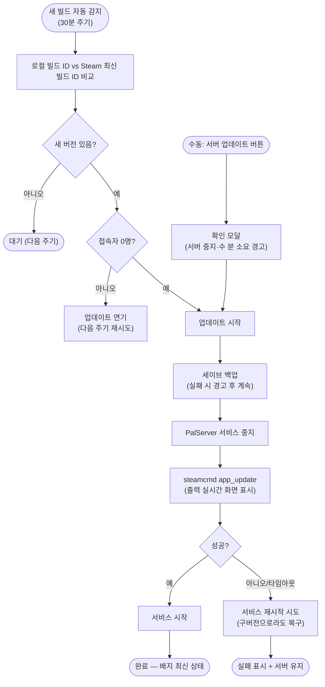

# 게임 업데이트 후 버전 불일치로 접속 불가 - 서버 바이너리 업데이트 기능 추가

## 개요

팰월드 클라이언트가 업데이트되자 서버 바이너리(v1.0.0.100427)가 구버전이 되어 "참가하려는 경기에 비호환 버전 게임이 실행중입니다" 오류로 접속이 거부됐다. 재시작 버튼은 같은 구버전 바이너리를 다시 켤 뿐이라 해결책이 아니다. 이번 작업으로 어드민에 **SteamCMD 기반 서버 바이너리 업데이트**가 추가됐다 — 수동 "서버 업데이트" 버튼(실시간 진행 로그 표시)과 함께, 30분마다 새 빌드를 스스로 감지해 접속자가 없으면 **자동으로 업데이트·재시작**까지 수행한다. 앞으로 게임 업데이트가 나와도 관리자 개입 없이 서버가 스스로 최신 버전을 유지한다.

## 기능 흐름

## 변경 사항

### 업데이트 엔진 (신규)
- `suh-ai-server/flask/service/palworld_updater.py`: 빌드 감지(`appmanifest_2394010.acf` vs `steamcmd app_info_print`), 백그라운드 업데이트 실행(백업→중지→다운로드→시작), 진행 상태·출력 링버퍼, 30분 자동 체크 루프, steamcmd 무응답 1시간 워치독(강제 종료 후 복구)
- `suh-ai-server/flask/config/palworld_config.py`: SteamCMD 경로·앱 ID·체크 주기·타임아웃 상수

### API / 감사
- `suh-ai-server/flask/router/palworld_router.py`: `POST /palworld/update`(202/409), `GET /palworld/update/status`, `POST /palworld/update/check` + Swagger 문서화
- `suh-ai-server/flask/service/audit_service.py`: `SERVER_UPDATE` 감사 액션 추가 — 수동은 IP, 자동은 system으로 기록
- `suh-ai-server/flask/run.py`: 기동 시 자동 체크 루프 시작 (기동 직후 1회 즉시 체크)

### UI
- `suh-ai-server/flask/templates/admin/palworld.html` / `static/js/palworld.js`: 서버 상태 카드에 빌드 배지(최신 상태/업데이트 필요/판단 불가)·"업데이트 확인"·"서버 업데이트" 버튼, 진행 패널(단계 + steamcmd 실시간 출력, 3초 폴링), 완료/실패 토스트, 페이지 재진입 시 진행 복원 — **daisyUI native 컴포넌트만 사용, 커스텀 CSS 없음**

### 테스트
- `test_palworld_updater.py`(신규 15건) + `test_palworld_router.py`(+4건) — 전체 **118개 통과**

## 주요 구현 내용

- **서버를 절대 방치하지 않는다**: steamcmd 실패·타임아웃 등 어떤 실패 경로에서도 서비스 재시작을 시도해 최소한 구버전으로라도 서버를 살려둔다. 무응답 워치독이 멈춘 steamcmd를 강제 종료해 업데이터가 영구 고착되는 것도 차단했다.
- **자동 업데이트 정책**: 접속자가 있으면 강제 킥을 피해 연기하고, 접속자 판단이 불가(REST 다운)하면 0명으로 간주해 진행 — 서버가 비정상이면 어차피 갱신이 이득이라는 판단.
- **성공 판정**: steamcmd는 성공해도 0이 아닌 종료 코드를 낼 수 있어, 출력의 `Success!` 문자열을 함께 확인한다.
- **감사로그 연동**: 누가(IP/system) 언제 어떤 트리거(manual/auto)로 어떤 빌드로 업데이트했는지 #70 감사 체계에 기록된다.

## 주의사항

- 실제 steamcmd 실행 검증은 서버 배포 후 첫 업데이트에서 이뤄진다 (개발망 외부 인터넷 차단으로 로컬 검증 불가)
- 배포 직후 자동 체크가 즉시 실행되므로, 접속자 0명이면 **자동으로 이번 긴급 업데이트가 시작**된다 — 어드민 화면에서 진행 로그 확인 가능
- 잔여 개선 후보(비차단): 버전 정보 락 범위 보강, 수동 확인·자동 체크 동시 실행 시 steamcmd 중복 조회 방지
