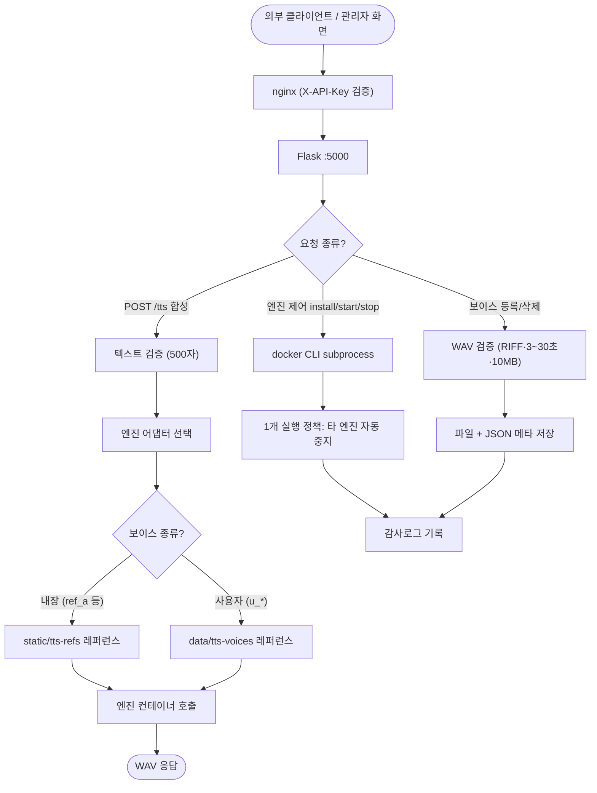

# TTS 엔진 매니저 및 외부 공개 TTS 서비스 구현

## 개요

관리자 화면(`/admin/tts`)에서 여러 TTS 엔진(Kokoro-82M, CosyVoice2-0.5B)을 설치·전환·테스트할 수 있는 엔진 매니저를 구축하고, 외부 사용자를 위한 REST API(`POST /tts`)와 보이스 클로닝 등록 API(`POST /tts/voices`)를 공개했다. 엔진 실행은 Docker 컨테이너로 격리하고, VRAM 8GB(RTX 4060) 보호를 위해 한 번에 1개 엔진만 실행하는 정책을 적용했다. 사용법 가이드는 관리자 페이지 내 접이식 섹션으로 게시해 링크 공유만으로 외부 사용자가 열람할 수 있다.

## 기능 흐름

## 변경 사항

### 엔진 매니저 (1단계)

- `config/tts_config.py`: 엔진 카탈로그 레지스트리 — 새 엔진 추가 시 항목 1개 + 어댑터 1개만 작성하면 되는 구조
- `service/tts/adapters.py`: Kokoro(OpenAI 호환 API)·CosyVoice(cross-lingual, raw PCM→WAV 래핑) 형식 차이를 `synthesize(text, voice, speed) → WAV` 공통 인터페이스로 흡수
- `service/tts_service.py`: docker CLI 기반 수명주기(설치/시작/중지/로그/상태), 설치는 백그라운드 스레드로 pull 진행률·로그 tail 추적
- `router/tts_router.py`, `router/tts_swagger.py`: 합성·엔진 제어 API + Swagger 문서화
- `templates/admin/tts.html`, `static/js/tts.js`: 엔진 카드(상태 뱃지·설치 진행률), 컨테이너 로그 모달, 합성 테스트 패널
- `docker/cosyvoice/Dockerfile`, `.github/workflows/SUH-AI-TTS-IMAGE.yaml`: CosyVoice 서빙 이미지 빌드·배포 파이프라인
- `scripts/deploy-tts.ps1`: 배포 시 GPU 패스스루 검증 + 모델 캐시 볼륨 준비 (실패해도 본 배포는 차단하지 않음)

### 외부 공개 서비스 (2단계)

- `service/tts/voice_store.py`: 사용자 보이스 저장소 — 파일 + JSON 메타(DB 비의존, fail-open 철학), RIFF 직접 파싱으로 float32 WAV 길이 검증
- `router/tts_router.py`: `GET/POST /tts/voices`, `DELETE /tts/voices/<id>` 추가, 합성 텍스트 500자 제한
- `templates/admin/tts.html`: 보이스 관리 카드(업로드·미리듣기·삭제) + API 사용 가이드 섹션(예제 코드 curl/Python/JS, 클로닝 절차, 제한사항)
- `service/audit_service.py`: TTS 카테고리 및 엔진 제어·보이스 등록/삭제 감사 액션 추가

## 주요 구현 내용

- **어댑터 패턴**: 엔진마다 다른 API 형식(OpenAI 호환 vs 자체 FastAPI)을 어댑터가 흡수해, 외부 공개 API는 엔진 교체와 무관하게 불변
- **1개 실행 정책**: 다른 엔진 시작 요청 시 실행 중 엔진을 자동 중지 — VRAM 8GB에서 Ollama(OCR·Vision)와 공존
- **제로샷 보이스 클로닝**: 합성 요청 시 레퍼런스 음성을 함께 전송하는 CosyVoice cross-lingual 모드 — 학습 없이 등록 즉시 사용 가능
- **업로드 보안**: 파일명 uuid 정규화(경로 조작 차단), RIFF 헤더·재생 길이(3~30초)·크기(10MB) 검증
- **사용자 데이터 보존**: 업로드 보이스는 SCP 배포 경로 밖(`data/`)에 저장해 배포에도 유지

### 트러블슈팅

1. **CosyVoice 이미지 빌드 실패**: pip 빌드 격리 환경의 최신 setuptools(82+)에서 `pkg_resources` 제거로 소스 빌드 실패 → `PIP_CONSTRAINT`로 `setuptools<81` 강제
2. **CosyVoice 컨테이너 기동 실패**: 학습 전용 deepspeed가 import 시 CUDA 컴파일을 시도하나 runtime 이미지에 컴파일러 부재(`CUDA_HOME` 오류) → 추론 이미지에서 deepspeed 제거

## 주의사항

- 사용자 등록 보이스는 CosyVoice 전용 (Kokoro는 내장 프리셋만)
- CosyVoice 첫 기동은 모델 자동 다운로드로 수 분 소요 — 모델은 `suh-tts-models` 볼륨에 캐시되어 재기동 시 즉시 로드
- 추후 개선 후보: 보이스 소유자 개념(본인 것만 삭제), API 키별 사용량 통계, 스트리밍 합성, Gepard 등 엔진 추가
