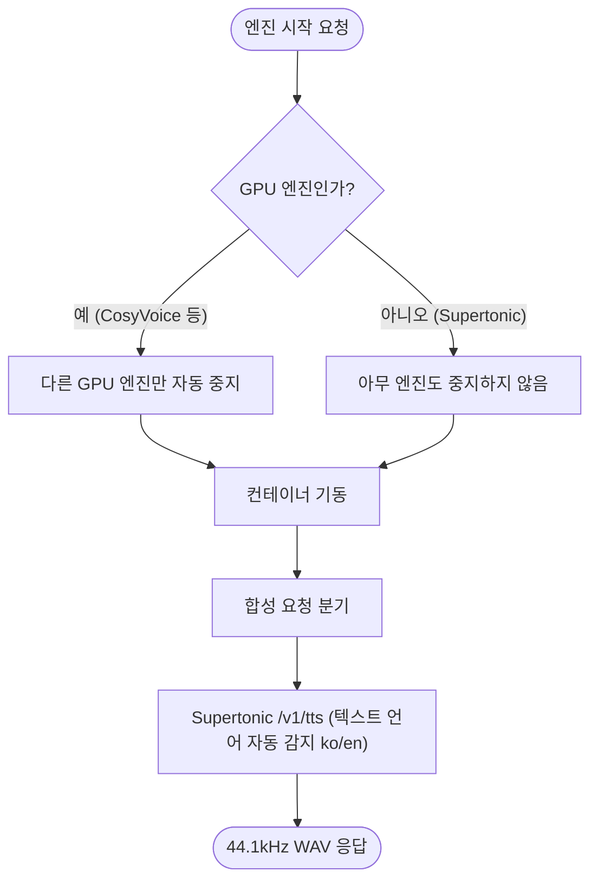

# Supertonic 한국어 초경량 CPU TTS 엔진 추가

## 개요

Supertone(하이브 계열)의 오픈소스 온디바이스 TTS **Supertonic**(66M 파라미터, ONNX)을 세 번째 엔진으로 추가했다. 한국어 포함 31개 언어를 지원하며 **CPU 전용이라 GPU(VRAM)를 전혀 점유하지 않는다** — 이를 계기로 엔진 실행 정책을 "전체 1개"에서 "**GPU 엔진만 1개, CPU 엔진은 상시 동시 가동**"으로 확장했다.

## 기능 흐름

## 변경 사항

### 서빙 인프라
- `docker/supertonic/Dockerfile`: `python:3.11-slim` + `supertonic[serve]` — 공식 HTTP 서버(`/v1/tts`) 그대로 사용, 모델은 첫 기동 시 볼륨 캐시
- `SUH-AI-TTS-IMAGE.yaml`: supertonic 빌드 잡 추가 (레이어 캐시 scope 분리)

### 백엔드
- `config/tts_config.py`: supertonic 레지스트리 항목 (`gpu: False` 플래그 도입)
- `service/tts/adapters.py`: SupertonicAdapter — 텍스트에서 한글/라틴 감지해 `lang` 자동 지정
- `service/tts_service.py`: GPU/CPU 구분 실행 정책, 엔진 제어 직후 상태 캐시 무효화

### UI
- 합성 테스트 패널: 실행 중 엔진이 여러 개일 때 엔진 선택 드롭다운
- 엔진 시작 확인 모달: GPU 엔진끼리 교체될 때만 표시

## 실서버 검증 결과

| 항목 | 결과 |
|---|---|
| 한국어 합성 (`voice=F1`) | HTTP 200, 356KB WAV, **1.17초** |
| CosyVoice(GPU)와 동시 가동 | 정상 — CPU 엔진이라 VRAM 무점유 |
| 시작 → running 전환 | 약 1분 (모델 자동 다운로드 포함) |

## 주의사항

- Supertonic은 고정 프리셋 보이스(M1~M5/F1~F5) — 보이스 클로닝은 CosyVoice 담당 유지
- speed 파라미터는 서버 미지원으로 무시됨
- 라이선스: 코드 MIT / 모델 OpenRAIL-M
