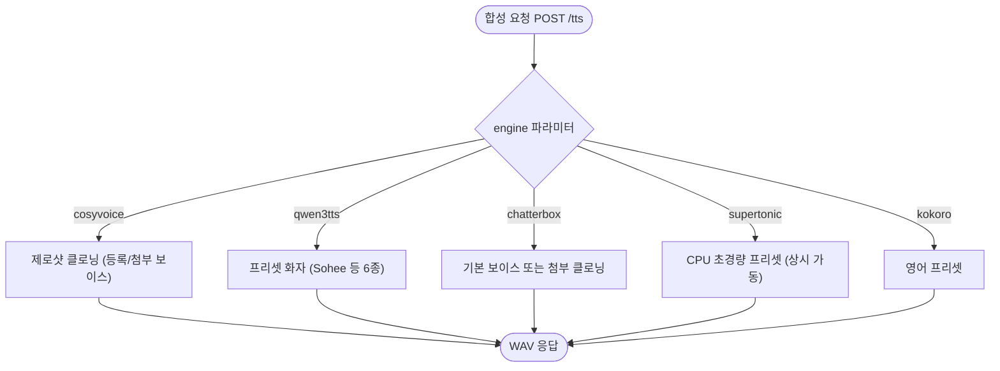

# TTS 엔진 확장 - Qwen3-TTS 0.6B·Chatterbox Multilingual 추가 (Fish S2 제외)

## 개요

한국어 지원 TTS 엔진 2종을 카탈로그에 추가해 총 5개 엔진 체제를 완성했다. Qwen3-TTS는 한국어 화자(Sohee)가 내장된 프리셋 방식(Apache-2.0), Chatterbox는 기본 보이스 + 요청 첨부 원샷 클로닝(MIT)을 지원한다. Fish Audio S2는 가중치는 공개지만 라이선스가 연구/비상업 전용이라 외부 서비스 제공 목적에 부적합해 제외했다.

## 기능 흐름

## 변경 사항

### 서빙 인프라
- `docker/qwen3tts/`: qwen-tts 패키지 기반 FastAPI 서버 (`/synthesize`) — bf16, 프리셋 화자
- `docker/chatterbox/`: chatterbox-tts 기반 FastAPI 서버 — 선택적 prompt_wav 첨부로 원샷 클로닝
- `SUH-AI-TTS-IMAGE.yaml`: 엔진별 빌드 잡 4개 체제 (레이어 캐시 scope 분리)

### 백엔드
- 레지스트리에 qwen3tts·chatterbox 항목 추가, 어댑터 2종 (한글 감지로 언어 자동 지정)
- Swagger 엔진 enum 갱신

## 실서버 검증 결과

| 엔진 | 한국어 합성 | 비고 |
|---|---|---|
| Qwen3-TTS (Sohee) | HTTP 200 · 315KB · 12.0s | 첫 요청 워밍업 포함 |
| Chatterbox (default) | HTTP 200 · 342KB · 12.7s | CPU 엔진(supertonic)과 동시 가동 확인 |

## 트러블슈팅

1. **Chatterbox 기동 크래시**: pip이 베이스 torch(2.5.1)와 어긋난 torchvision을 설치해 `torchvision::nms operator 없음` 오류 → 베이스를 torch 2.6.0으로 올리고 torch/torchvision/torchaudio 트리오를 cu124 인덱스에서 강제 고정
2. **관리자 화면 폴링 고갈 재발**: 상태 캐시 재계산 동안 다른 스레드가 락 대기로 묶이는 구조 결함 → 재계산 중에는 낡은 캐시를 즉시 반환(stale-while-revalidate), 상태 확인용 docker 호출 타임아웃 5초, waitress 스레드 4→16

## 주의사항

- Fish Audio S2 도입 시 상업 라이선스 계약 필요 (제외 사유)
- GPU 엔진(cosyvoice/qwen3tts/chatterbox/kokoro)은 한 번에 1개, CPU 엔진(supertonic)은 상시 동시 가동
- Qwen3-TTS 클로닝(Base 모델)·보이스 디자인은 미도입 — 필요 시 후속 확장 후보
