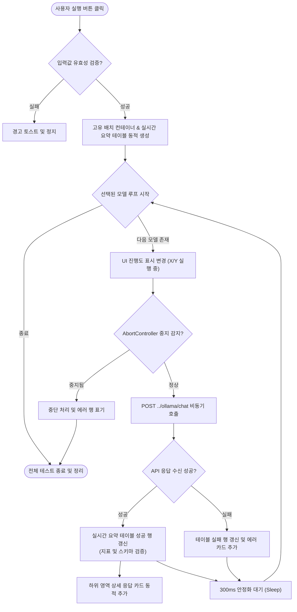

# Ollama Structured Output 테스트 페이지 다중 모델 순차 벤치마크 및 지표 상세화 고도화

## 개요
Ollama 기반 Structured Output(구조화 출력) 및 JSON Schema 테스트 페이지(`ollama-test.html`, `ollama-test.js`)에 설치된 여러 인공지능 모델들을 계열(Family)별로 묶어 다중 체크박스로 한눈에 보며 쉽게 일괄 선택하여 테스트하는 고도화된 벤치마크 대시보드를 구축하였습니다. 
서버 VRAM 과부하 방지를 위해 순차 비동기 루프 및 300ms 안정화 슬립을 보장하고, 실행 중단 제어를 위해 `AbortController`를 구성하였으며, 총 시간/로드 지연/추론 지연/입출력 토큰 정보/추론 속도(tok/s)를 한데 정렬하는 실시간 요약 비교 테이블과 클라이언트 단 즉석 스키마 자체 검증 렌더러 및 `localStorage` 영구 보존 정책을 도입해 개발 분석 환경을 극대화하였습니다.

## 기능 흐름



## 변경 사항

### 프론트엔드 마크업 개편
- `suh-ai-server/flask/templates/admin/ollama-test.html`:
  - 단일 모델 select 드롭다운 컴포넌트를 계열(Family) 카테고리별로 정렬된 다중 체크박스 목록 영역(`model-checkbox-list`)으로 개편
  - 배치 일괄 지정을 위한 '전체 선택', '전체 해제' 헬퍼 조작 컨트롤 추가
  - 실행 중단을 위한 '중지' 버튼 및 백그라운드 진행 상태 표시 프로그레스 바 영역 신설

### 벤치마크 및 동적 시각화 구현
- `suh-ai-server/flask/static/js/ollama-test.js`:
  - `localStorage` 상태 보존 바인딩 함수(`saveState`, `restoreState`)를 구현하여 새로고침 시에도 프롬프트, 온도, JSON Schema 양식 및 체크된 모델 선택 목록 유지 보장
  - `AbortController` 시그널 전파를 구현하여 다중 모델 호출 도중 사용자가 원할 때 우아하게 안전 취소(Stop)할 수 있는 가드 구축
  - 모델 전환 리로딩 간격의 오염을 차단하기 위해 300ms의 `sleep` 유틸 슬립 로직 구축
  - 매 요청 성공 시 입력/출력 토큰 규모와 로딩 지연, 추론 지연, 속도(tok/s)를 매핑하는 실시간 배치 요약 비교 테이블 동적 렌더링 구현
  - 반환된 JSON 문자열이 기재한 JSON Schema 사양(최상위 required 필드 존재 여부 및 자료형 결합도)을 완전 충족하는지 클라이언트 사이드에서 가볍게 분석해 주는 자체 정밀 `verifySchemaCompliance` 검증기 도입

## 주요 구현 내용

### 비동기 순차 직렬화 벤치마크 및 Abort 신호 전파 로직
```javascript
// 중지 제어용 abortController
let abortController = null;

async function run() {
  ...
  abortController = new AbortController();
  const { signal } = abortController;
  ...
  try {
    for (const model of selectedModels) {
      if (signal.aborted) break;
      ...
      try {
        const resp = await fetch(OLLAMA_API + '/chat', {
          method: 'POST',
          headers: { 'Content-Type': 'application/json' },
          body: JSON.stringify(reqBody),
          signal: signal, // 중지 시그널 주입
        });
        const data = await resp.json();
        ...
        updateTableSuccessRow(row, model, data.metrics, data.content);
        addDetailCard(batchWrapper, { ok: true, model: model, mode: formatMode, content: data.content, metrics: data.metrics });
      } catch (err) {
        if (err.name === 'AbortError') {
          updateTableFailRow(row, model, '중단됨');
          break;
        }
        ...
      }
      await sleep(300); // VRAM 로드 안정화를 위한 300ms 인터벌
    }
  } ...
}
```

## 주의사항
- 여러 AI 모델이 연속적으로 메모리(VRAM)에 올라갔다 내려가는 과정(Model swap)이 발생하므로, 서버의 하드웨어 스펙에 따라 첫 토큰 출력 지연(TTFT)에 일시적인 지연 폭주가 생길 수 있습니다. 이를 예방하기 위해 적용된 300ms의 안정화 슬립 주기를 하향 조절할 때에는 유의가 필요합니다.
