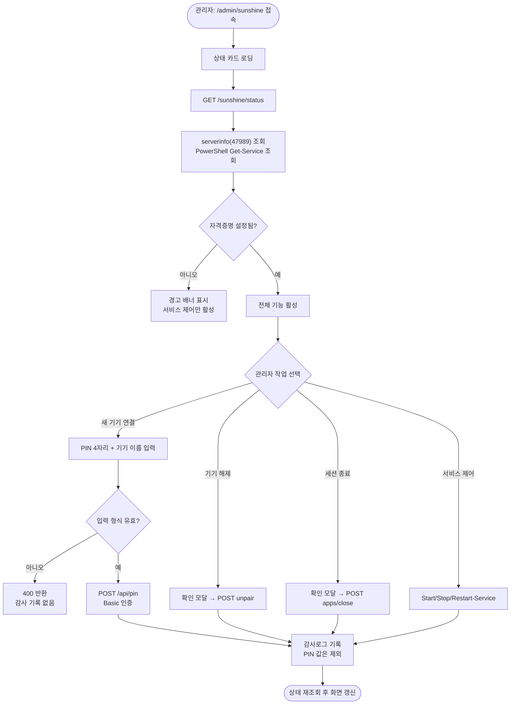

# Sunshine(Moonlight) 원격 스트리밍 제어 페이지 추가

## 개요

AI 서버의 Sunshine 스트리밍 호스트를 관리 대시보드에서 직접 제어할 수 있는 페이지(`/admin/sunshine`)를 추가했다. 기존에는 새 기기 페어링 PIN을 서버 화면의 Windows 알림이나 localhost 전용 웹 UI(47990)에서만 입력할 수 있어, 원격지에서는 새 기기를 연결할 방법이 없었다. 이제 외부에서 관리 페이지에 접속해 PIN 승인, 기기 목록 관리, 세션 종료, 서비스 제어, 로그 조회를 모두 처리할 수 있다.

구현에 앞서 실측 조사를 진행했고, 그 과정에서 **Moonlight 외부 접속 자체는 정상 동작한다**는 사실을 확인했다. 맥북에서 공인 IP로 실제 스트림을 수신해 60fps 인코더 기동과 `CLIENT CONNECTED` 로그까지 확인했으며, TCP 47984/47989/48010과 UDP 47998~48000 포워딩이 모두 살아 있었다. 접속 실패로 보였던 현상은 Moonlight가 저장된 LAN 주소(172.30.1.14)를 먼저 시도하는 구간에서 호스트가 일시적으로 offline로 표시되던 것이었다.

## 기능 흐름

## 변경 사항

### 신규 파일

- `flask/config/sunshine_config.py`: API 주소, 서비스명, 타임아웃, 공개 호스트, 앱 ID 매핑 정의. 자격증명은 요청 시점에 환경변수에서 읽는다
- `flask/service/sunshine_service.py`: Sunshine 웹 API 연동, serverinfo XML 파싱, Windows 서비스 제어
- `flask/router/sunshine_router.py`: 상태·기기 목록·PIN 승인·페어링 해제·세션 종료·서비스 제어·로그 엔드포인트
- `flask/templates/admin/sunshine.html`: 카드 4개 구성 페이지와 확인 모달 2개
- `flask/static/js/sunshine.js`: 상태 5초 폴링, 로그 자동 새로고침, 확인 모달 처리
- `flask/test/test_sunshine_service.py`: 서비스 계층 단위 테스트 18개
- `flask/test/test_sunshine_router.py`: 라우터 계층 단위 테스트 19개

### 기존 파일 수정

- `flask/app.py`: 블루프린트 등록
- `flask/router/admin_router.py`: 페이지 렌더 라우트 추가
- `flask/templates/admin/base.html`: 사이드바 메뉴 항목 추가
- `flask/service/audit_service.py`: 감사 카테고리 `SUNSHINE`과 액션 6종 추가
- `flask/static/js/audit.js`, `flask/templates/admin/audit.html`: 감사로그 화면의 한국어 라벨과 카테고리 필터 추가
- `flask/static/css/app.css`: 신규 클래스 포함 재빌드
- `flask/test/test_admin_router.py`: 페이지 렌더 및 이모지 금지 검증에 신규 경로 추가

## 주요 구현 내용

### 상태 정보를 두 소스에서 조합

Sunshine의 스트림 상태(FREE/BUSY)와 실행 중 앱은 인증 없는 47989 `serverinfo`에서만 얻을 수 있고, 서비스 구동 여부는 Windows 서비스 조회로만 알 수 있다. 두 소스를 합쳐 하나의 상태 응답으로 내려준다. serverinfo 조회 실패는 예외로 올리지 않고 `api_reachable: false`로 표현한다. 서비스가 내려가 있으면 응답이 없는 것이 정상 상황이기 때문이다.

### Sunshine 인증 실패를 502로 변환

Sunshine 웹 API가 401을 반환할 때 그대로 내리면, 프론트의 공통 fetch 래퍼가 이를 관리자 API Key 만료로 오인해 키 입력 모달을 띄운다. 서로 다른 두 인증 계층이 같은 상태 코드를 쓰기 때문이다. 따라서 Sunshine 쪽 인증·연결 실패는 모두 502로 변환하고, 원인 구분용 `code` 필드(`credentials_missing`, `auth_failed`, `unreachable`)를 함께 내려 화면에서 안내 문구를 나눈다.

### 실행 중 앱 이름 표시

serverinfo는 앱 ID만 준다. Sunshine 내부의 ID 산출 해시를 재현하려 여러 조합을 검증했으나 일치하는 규칙을 찾지 못해, 페어링된 클라이언트로 조회한 앱 목록에서 확인한 값을 설정 파일의 매핑 표에 두었다. 표에 없는 ID는 원문 그대로 표시되므로 앱을 추가해도 화면이 깨지지 않는다.

### 감사로그에 PIN을 남기지 않음

PIN 승인은 감사 대상이지만 PIN 값 자체는 기록하지 않고 기기 이름만 남긴다. 입력 형식 검증에서 걸러진 요청(400)은 액션을 지정하기 전에 반환되므로 감사 기록이 생성되지 않는다. 이는 기존 감사 규칙과 동일한 방식이다.

## 검증 결과

### 단위 테스트

전체 355개 통과 (기존 318개 + 신규 37개). 외부 호출은 전부 모킹했다.

### 배포 서버 실측

| 항목 | 결과 |
|---|---|
| 페이지 렌더 | HTTP 200, PIN 폼·기기 목록·모달 요소 모두 존재 |
| 상태 조회 | 서비스 구동 중, 스트림 BUSY, 실행 앱 Desktop 정상 표시 |
| 자격증명 인식 | `credentials_configured: true` |
| 기기 목록 | 등록된 7개 기기 정상 조회 |
| 로그 조회 | Sunshine 로그 실시간 조회 정상 |
| 입력 검증 | 잘못된 PIN·잘못된 액션 모두 400 반환 |
| 외부 접속 | 공개 도메인에서 페이지 200, 사이드바 메뉴 노출 확인 |

## 주의사항

### 환경 파일은 배포 때 덮어써진다

배포 워크플로우가 GitHub Secret의 내용으로 서버 환경 파일을 새로 만든다. 따라서 서버에서 직접 값을 추가하면 다음 배포에서 사라진다. 이번 작업에서 실제로 한 번 유실됐고, Secret을 갱신해 해결했다. 앞으로 환경 변수를 추가할 때는 반드시 Secret 쪽을 함께 갱신해야 한다.

### 페어링된 기기에 중복 항목이 있다

같은 기기를 여러 번 페어링하면 이름이 중복 등록된다. 현재 동일한 이름으로 여러 항목이 남아 있으므로, 페이지의 해제 기능으로 정리할 수 있다. 다만 해제된 기기는 다시 PIN 페어링이 필요하다.

### 세션 강제 종료는 접속을 끊는다

BUSY 상태를 푸는 기능이지만 접속 중인 클라이언트가 있으면 연결이 끊긴다. 화면에서 확인 모달을 거치도록 했고, 버튼은 BUSY 상태일 때만 활성화된다.

### Sunshine 웹 UI 자체는 외부에 노출되지 않는다

Sunshine의 관리 UI 포트는 외부로 포워딩되어 있지 않고 기본 설정상 LAN 접속만 허용한다. 이 페이지는 서버 내부에서 Sunshine API를 호출하는 방식이라 포트를 추가로 열 필요가 없다. Sunshine 설정 편집이나 앱 목록 관리까지 외부에서 하려면 별도 노출 작업이 필요하다.
