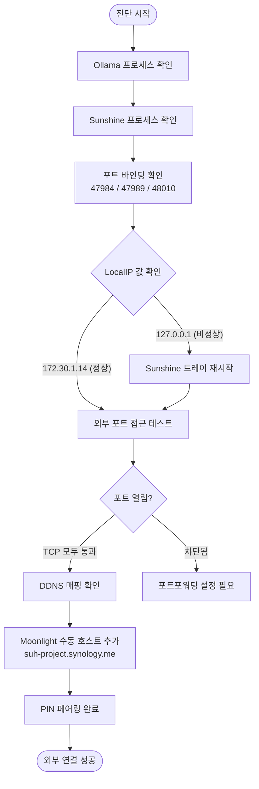

# Sunshine 스트리밍 서버 외부 연결 복구 및 Ollama 서버 상태 진단

## 개요

로컬 PC(SUH-PROJECT-AI)에서 운영 중인 Sunshine 게임 스트리밍 서버가 외부 Moonlight 클라이언트에서 "오프라인"으로 표시되는 문제를 진단하고 복구했다. Ollama LLM 서버의 외부 접근 가능 여부도 함께 점검했다.

## 기능 흐름

## 실행 명령어 및 결과

### Ollama 상태 확인

| 명령어 | 결과 |
|--------|------|
| `GET http://localhost:11434/api/tags` | 200 OK — 모델 44개 등록 확인 |
| `Get-Process \| Where-Object { $_.Name -like "*ollama*" }` | `ollama` × 2, `ollama app` × 1 실행 중 확인 |

### Sunshine 상태 확인

| 명령어 | 결과 |
|--------|------|
| `Get-Process \| Where-Object { $_.Name -like "*sunshine*" }` | `sunshine`, `sunshinesvc` 실행 중 |
| `netstat -ano \| Select-String "47984\|47989\|48010"` | 3개 포트 모두 `0.0.0.0` LISTENING |
| `GET http://localhost:47989/serverinfo` | XML 응답 — `LocalIP: 127.0.0.1` (비정상), `state: SUNSHINE_SERVER_BUSY` |
| `Get-Service SunshineService` | Running |

### 외부 접근 테스트

| 명령어 | 결과 |
|--------|------|
| `curl https://api.ipify.org` | 공인 IP `183.98.211.213` 확인 |
| `Resolve-DnsName suh-project.synology.me` | `183.98.211.213` 정확히 매핑 확인 |
| `Test-NetConnection -ComputerName 183.98.211.213 -Port 47984` | `TcpTestSucceeded: True` |
| `Test-NetConnection -ComputerName 183.98.211.213 -Port 47989` | `TcpTestSucceeded: True` |
| `Test-NetConnection -ComputerName 183.98.211.213 -Port 48010` | `TcpTestSucceeded: True` |
| `curl http://suh-project.synology.me:11434/api/tags` | **실패 (Exit code 7)** — 11434 포트포워딩 미설정 |

### Sunshine 재시작 후 재확인

| 명령어 | 결과 |
|--------|------|
| `GET http://localhost:47989/serverinfo` | `state: SUNSHINE_SERVER_FREE`, `currentgame: 0` (정상화) |

## 변경 사항

### Sunshine 설정 (수동 조치)

- 트레이 아이콘에서 Sunshine 재시작 수행
- Moonlight 클라이언트에서 `suh-project.synology.me` 수동 호스트 추가 후 PIN 페어링 완료

## 주요 구현 내용

**문제 원인**: Sunshine `serverinfo` 응답에서 `<LocalIP>127.0.0.1</LocalIP>` 및 `<mac>00:00:00:00:00:00</mac>`가 비정상 값으로 반환되었고, `state`가 `SUNSHINE_SERVER_BUSY`인 상태로 고착되어 있었다. 이로 인해 Moonlight이 LAN IP를 감지하지 못하고 "오프라인"으로 표시.

**해결**: Sunshine 트레이 재시작으로 `state`가 `SUNSHINE_SERVER_FREE`로 정상화. 외부 연결은 Synology DDNS(`suh-project.synology.me`) → 공인 IP `183.98.211.213` → 공유기 포트포워딩(47984/47989/48010 TCP) → 로컬 IP `172.30.1.14` 경로로 정상 동작 확인.

## 현재 서비스 상태 요약

| 서비스 | 상태 | 외부 접근 |
|--------|------|-----------|
| Ollama (11434) | 정상 | 불가 — 포트포워딩 미설정 |
| Sunshine (47984/47989/48010) | 정상 | 가능 — 페어링 완료 |
| DDNS (suh-project.synology.me) | 정상 | 공인 IP 자동 추적 중 |

## 주의사항

- **Ollama 외부 노출 미설정**: `suh-project.synology.me:11434`는 현재 외부에서 접근 불가. 공유기에서 11434 TCP 포트포워딩 추가 시 외부 접근 가능하나, Ollama는 기본적으로 인증이 없으므로 누구나 API 호출 가능 — 노출 전 방화벽 IP 제한 또는 리버스 프록시 인증 레이어 추가 권장.
- **LocalIP 127.0.0.1 근본 원인 미해결**: Sunshine이 네트워크 인터페이스를 잘못 감지하는 현상이 재발할 수 있음. `sunshine.conf`에 `address = 172.30.1.14` 고정 설정을 추가하면 재발 방지 가능 (`C:\Program Files\Sunshine\config\sunshine.conf` 관리자 권한으로 편집 필요).
- **MAC 주소 00:00:00:00:00:00**: Sunshine이 MAC을 감지 못하는 현상은 기능에 영향 없으나, 향후 업그레이드 시 재확인 필요.
